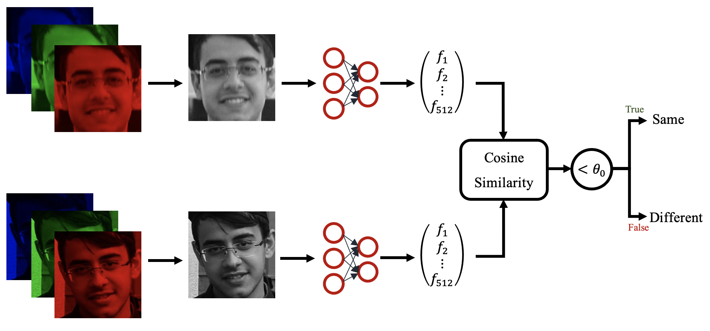

# Face Recognition with Face Classification and Verification

## Face Detection with HAAR Features

<table style="margin-left: auto; margin-right: auto; text-align: center" border=0 align=center>
  <tr>
    <td><strong>Original Image</strong></td>
    <td><strong>Detected Face in the Image</strong></td>
    <td><strong>Cropped Face</strong></td>
    <td><strong>Landmarked Face</strong></td>

   </tr> 
   <tr>
    <td> </td>
    <td> </td>
    <td> </td>
    <td> </td>

  </td>
  </tr>
</table>

## Face Classification

<ul>
  <li><strong>Input + Backbone Network:</strong>
    <ul>
      <li>Gray + ResNet-18</li>
      <li>RGB + ResNet-18</li>
      <li>RGB + ResNet-50</li>
    </ul>
  </li>
  <li><strong>Loss Function:</strong>
    <ul>
      <li>ArcFace</li>
    </ul>
  </li>
</ul>

<ul>
  <li><strong>Hyper-Parameters:</strong>
  </li>
</ul>

<table border=0 align=center style="text-align: center">
  <theader>
    <tr>
      <th> Hyper-Parameters </th>
      <th> Value </th>
    </tr>
  </theader>
  <tbody>
    <tr>
      <td>s</td>
      <td>64</td>
    </tr>
    <tr>
      <td>m</td>
      <td>0.5</td>
    </tr>
    <tr>
      <td>Epoch</td>
      <td>100</td>
    </tr>
    <tr>
      <td>Epoch</td>
      <td>0.9</td>
    </tr>
    <tr>
      <td>Epoch</td>
      <td>5e-4</td>
    </tr>
  </tbody>
</table>

<ul>
  <li><strong>Learning Rate:</strong>
  </li>
</ul>

<table border=0 align=center  style="text-align: center">
  <theader>
    <tr>
      <th><strong>Epoch</strong></th>
      <th><strong>Value</strong></th>
    </tr>
  </theader>
  <tbody>
    <tr>
      <td>[1,20]</td>
      <td>1e-1</td>
    </tr>
    <tr>
      <td>[21,30]</td>
      <td>1e-2</td>
    </tr>
    <tr>
      <td>[31,40]</td>
      <td>1e-3</td>
    </tr>
    <tr>
      <td>[41,60]</td>
      <td>1e-4</td>
    </tr>
    <tr>
      <td>[61,90]</td>
      <td>1e-5</td>
    </tr>
    <tr>
      <td>[91,100]</td>
      <td>1e-6</td>
    </tr>
  </tbody>
</table>

## Face Verification

<ul>
  <li><strong>Similarity Metrics:</strong>
    <ul>
      <li>Cosine Similarity</li>
    </ul>
  </li>
</ul>

$( Cosine-Similarity (x_1, x_2)=\frac{ \vec{x_1} \cdot \vec{x_2} }{\| x_1 \| \times \| x_2 \|} )$

<ul>
  <li><strong>Face Verification Flow Chart:</strong>
  </li>
</ul>

## Dataset

### Classification Dataset

<table border=0 align=center style="text-align: center">
  <thead>
    <tr>
      <th></th>
      <th>Num. of Categories</th>
      <th>Num. of Data per Category</th>
    </tr>
  </thead>
  <tbody>
    <tr>
      <td>Training</td>
      <td>1000</td>
      <td>16</td>
    </tr>
    <tr>
      <td>Validation</td>
      <td>1000</td>
      <td>4</td>
    </tr>
    <tr>
      <td>Training</td>
      <td>1000</td>
      <td>5</td>
    </tr>
  </tbody>
</table>

### Verification Dataset

<ul>
  <li><strong>166800 comparison between two images</strong>
  <ul>
      <li>The result of matching two images is in the <em>verification_dev.csv</em></li>
    </ul>
    <li>Distribution of Labels in Verification Dataset:</li>
  </li>
</ul>

<table  style="margin-left: auto; margin-right: auto; text-align: center" border=0 align=center>
  <tr>
    <td><strong>Number</strong></td>
    <td><strong>Percentage</strong></td>

   </tr> 
   <tr>
    <td> </td>
    <td> </td>

  </td>
  </tr>
</table>

## Results

### Classification Results

<ul>
  <li><strong>Classification Loss Function for Different Networks</strong>
  </li>
</ul>

<table  style="margin-left: auto; margin-right: auto; text-align: center"  border=0 align=center >
  <tr>
    <td><strong>Gray + ResNet-18</strong></td>
    <td><strong>RGB + ResNet-18</strong></td>
    <td><strong>RGB + ResNet-50</strong></td>

  </tr> 
  <tr>
    <td> </td>
    <td> </td>
    <td> </td>
  </tr>
</table>

### Verificaiton Results

<ul>
  <li><strong>Verification ROC Curve</strong>
  </li>
</ul>

<table style="margin-left: auto; margin-right: auto;" border=0 align=center>
   <tr>
    <td> </td>
  </tr>
</table>

<ul>
  <li><strong>Other Metrics</strong>
  </li>
</ul>

<table  style="margin-left: auto; margin-right: auto; text-align: center" border=0 align=center>
    <thead>
        <tr style="text-align: center">
            <th>Network</th>
            <th>Class</th>
            <th>Precision</th>
            <th>Recall</th>
            <th>F1-Score</th>
            <th>Threshold</th>
            <th>Accuracy</th>
        </tr>
    </thead>
    <tbody>
        <tr>
            <td rowspan=2>Gray + ResNet-18</td>
            <td>0</td>
            <td>0.62</td>
            <td>0.79</td>
            <td>0.70</td>
            <td rowspan=2>0.158</td>
            <td rowspan=2>66.9%</td>
        </tr>
        <tr>
            <td>1</td>
            <td>0.75</td>
            <td>0.56</td>
            <td>0.64</td>
        </tr>
        <tr>
            <td rowspan=2>RGB + ResNet-18</td>
            <td>0</td>
            <td>0.65</td>
            <td>0.83</td>
            <td>0.73</td>
            <td rowspan=2>0.162</td>
            <td rowspan=2>70.3%</td>
        </tr>
        <tr>
            <td>1</td>
            <td>0.79</td>
            <td>0.59</td>
            <td>0.68</td>
        </tr>
        <tr>
            <td rowspan=2>RGB + ResNet-50</td>
            <td>0</td>
            <td>0.64</td>
            <td>0.85</td>
            <td>0.73</td>
            <td rowspan=2>0.124</td>
            <td rowspan=2>70.2%</td>
        </tr>
        <tr>
            <td>1</td>
            <td>0.81</td>
            <td>0.56</td>
            <td>0.66</td>
        </tr>
    </tbody>
</table>

## Pretrained Model

<ul>
  <li><strong>Link:</strong>
    <ul>
      <li><a href="https://drive.google.com/file/d/1dkq3uACMCPLH60go6K0L4e-x1SRVMSUG/view?usp=sharing">Gray + ResNet-18</a></li>
      <li><a href="https://drive.google.com/file/d/1mvOV2bwzf9aluZzQkmkiRc3WyjlL00AE/view?usp=sharing">RGB + ResNet-18</a></li>
      <li><a href="https://drive.google.com/file/d/15Yst4PIUjTtvlcPPhf8bsrC5PmQocPSX/view?usp=sharing">RGB + ResNet-50</a></li>
    </ul>
  </li>
</ul>
